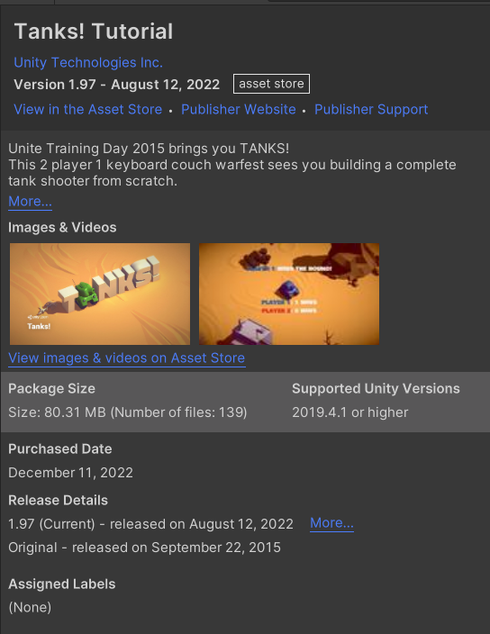
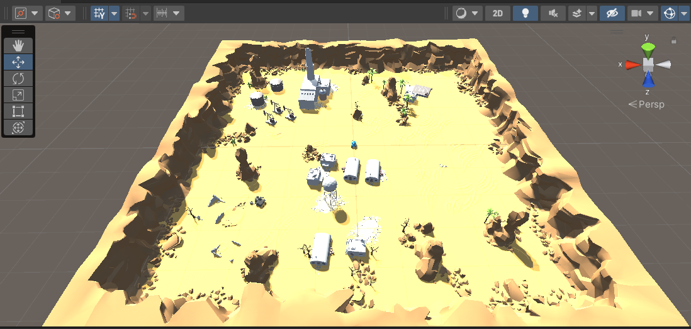

# homework10

### 20337259 叶泽霖

## 作业要求

-  坦克对战游戏 AI设计 从商店下载游戏：“Kawaii” Tank 或 其他坦克模型，构建 AI 对战坦克。具体要求： 
  -  使用“感知-思考-行为”模型，建模 AI 坦克 
  -  场景中要放置一些障碍阻挡对手视线 
  -  坦克要放置一个矩阵包围盒触发器，保证 AI 坦克能使用射线探测对手方位 
  -  AI 坦克必须在有目标条件下使用导航，并能绕过障碍。 
  -  实现人机对战

## 作业实现

### 模型及素材

- 使用的是在Unity Assert Store中找到的tank素材。
- 

### 地图实现

- 直接采用素材中的预制件
- 

### 玩家控制

- 和作业7中的玩家移动类似，

```c#
void fixedUpdate () {
        if (!action.isGameOver())
        {
            if (Input.GetKey(KeyCode.W))
            {
                 player.GetComponent<Rigidbody>().velocity = player.transform.forward * 20;
            }
            if (Input.GetKey(KeyCode.S))
            {
                 player.GetComponent<Rigidbody>().velocity = player.transform.forward * -20;
            }
            if (Input.GetKeyDown(KeyCode.Space))
            {
                GameObject bullet = mf.getBullet(tankType.Player);
        bullet.transform.position = new Vector3(player.transform.position.x, 1.5f, player.transform.position.z) + player.transform.forward * 1.5f;
        bullet.transform.forward = player.transform.forward;
        Rigidbody rb = bullet.GetComponent<Rigidbody>();
        rb.AddForce(bullet.transform.forward * 20, ForceMode.Impulse);
            }
            float offsetX = Input.GetAxis("Horizontal");
            action.turn(offsetX);
        }
```

### 工厂模式生成AI坦克

- 工厂模式以单例模式生成，主要包括创建巡逻坦克的函数。

```c#
public GameObject getTank()
    {
        if(freeTanks.Count == 0)
        {
            GameObject newTank = Instantiate<GameObject>(tank);
            usingTanks.Add(newTank.GetInstanceID(), newTank);
            newTank.transform.position = new Vector3(Random.Range(-100, 100), 0, Random.Range(-100, 100));
            return newTank;
        }
        foreach (KeyValuePair<int, GameObject> pair in freeTanks)
        {
            pair.Value.SetActive(true);
            freeTanks.Remove(pair.Key);
            usingTanks.Add(pair.Key, pair.Value);
            pair.Value.transform.position = new Vector3(Random.Range(-100, 100), 0, Random.Range(-100, 100));
            return pair.Value;
        }
        return null;
    }
```


