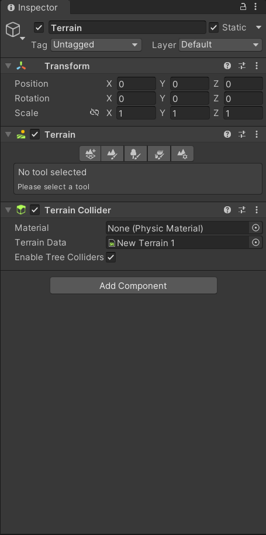
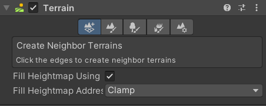
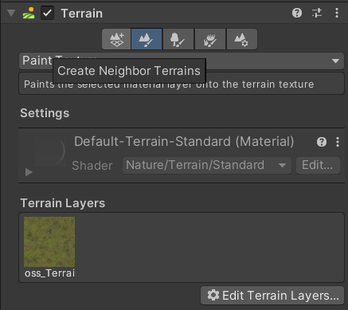
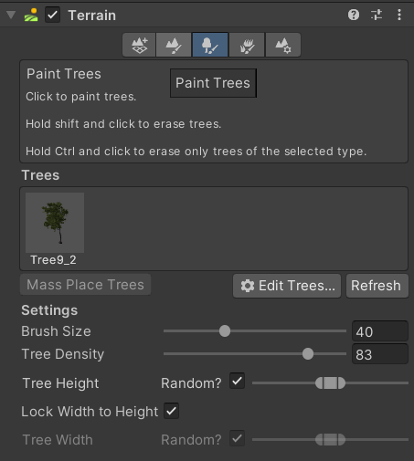
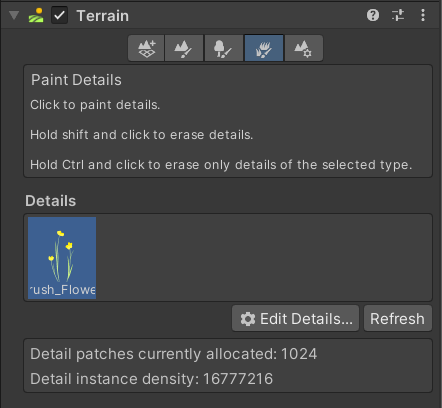
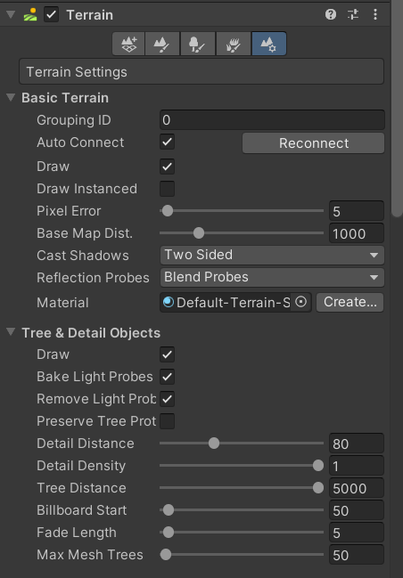
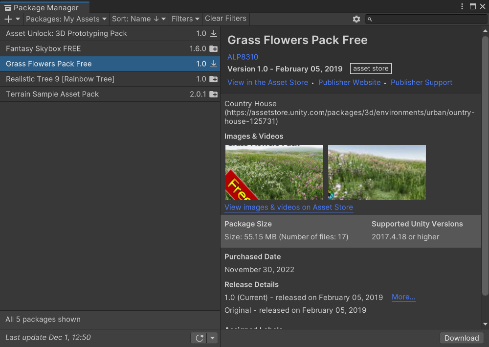
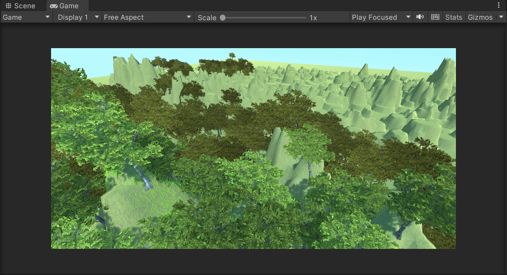
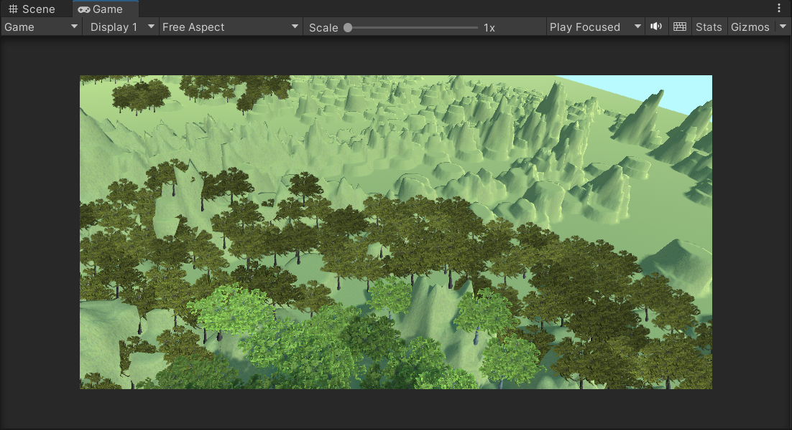
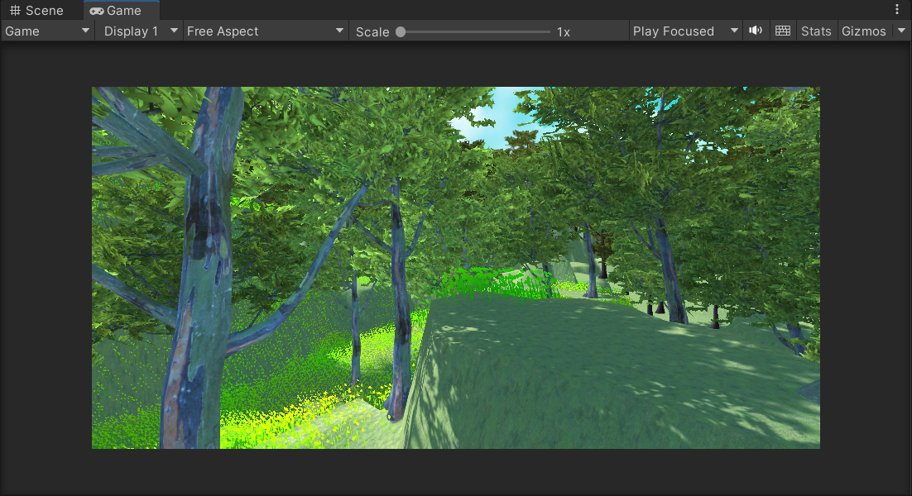

# homework4

### 20337259 叶泽霖

## 作业要求

- 基本操作演练 
  - 下载 Fantasy Skybox FREE，构建自己的游戏场景，并为场景设计地形（含树木和草地等元素）

## 作业实现

### Terrain

- 在场景中新建terrain
- 
- 在terrain中查看
- 
- 创建临近地形
- 
- 绘制纹理
- 
- 绘制树木
- 
- 绘制草皮
- 
- 地形设置
- 

### 树木和草地

- 用到的主要是在unity store中找到的两个包。
- 
- 

## 实际效果

- 
- 
- 

