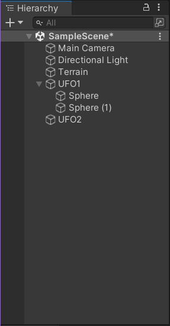
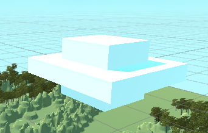
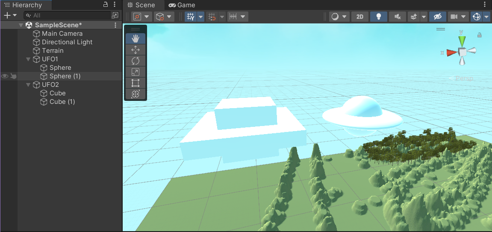
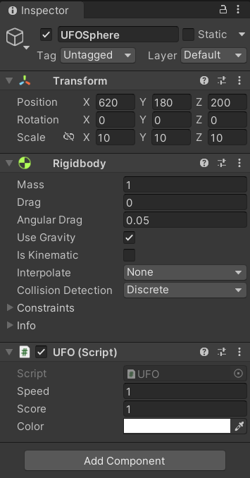
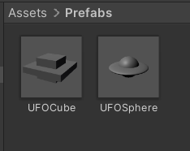
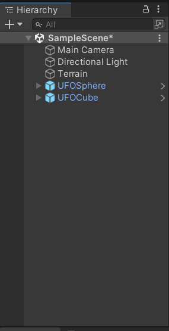
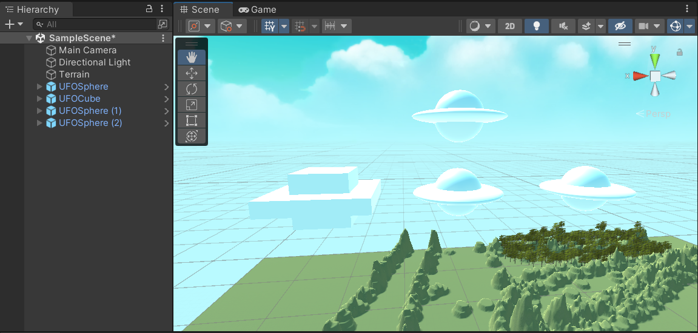

# homework5

### 20337259 叶泽霖

## 作业要求

-  编写一个简单的自定义 Component 
  - 用自定义组件定义几种飞碟，做成预制 
    - 参考官方手册 https://docs.unity3d.com/ScriptReference/Editor.html 
    - 实现自定义组件，编辑并赋予飞碟一些属性

## 作业实现

- 新建一个empty object并命名为UFO2

- 

- 新建两个立方体并调整他们的大小形状与位置

- 

- 在左边的组件中选中两个立方体并拖入到UFO2中，即可在形状上画出一个方形的飞碟。

- 

- 编写脚本以赋予其一些属性

- ```c#
  using System.Collections;
  using System.Collections.Generic;
  using UnityEngine;
  
  public class UFO : MonoBehaviour
  {
      public int speed= 1;
      public int score = 1; 
      public Color color = Color.white;
  }
  ```

- 将脚本附加在组件上

- 

- 将其做成预制件

- 

- 

- 然后就可以重复使用了

- 

