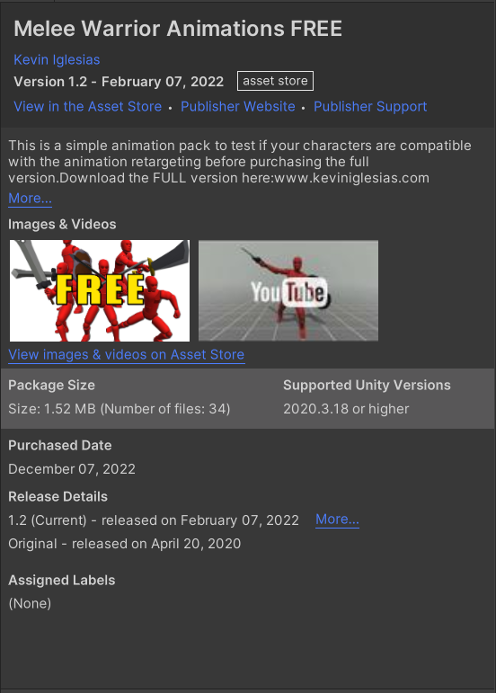
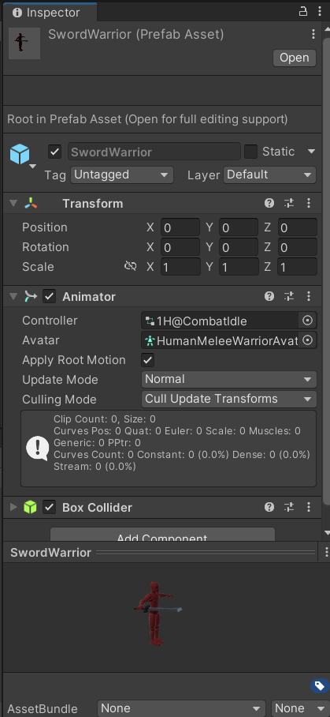
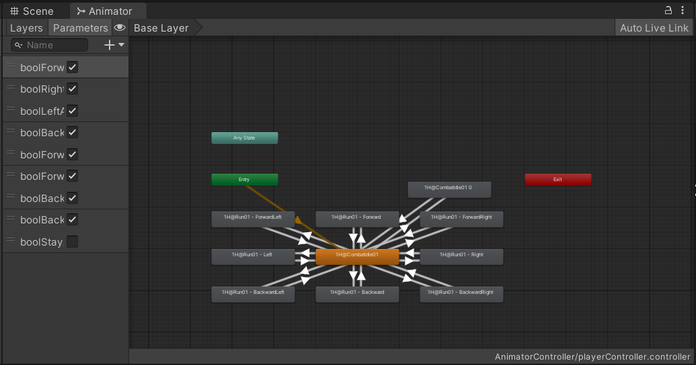
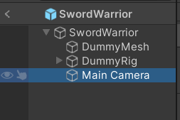
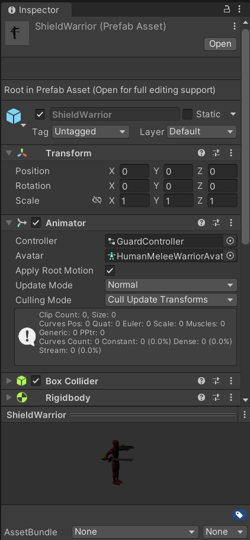
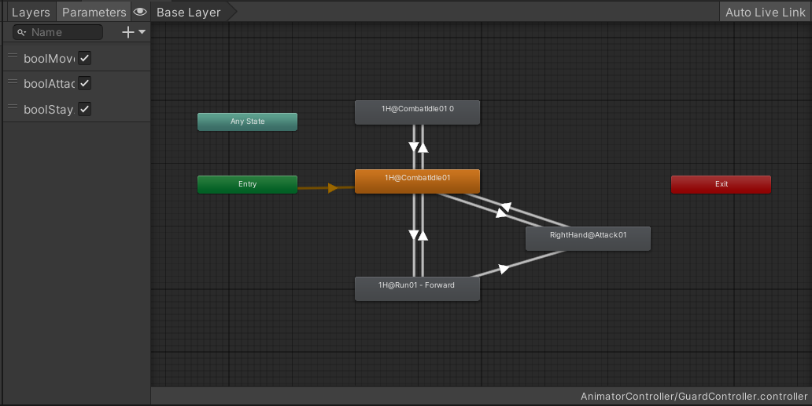
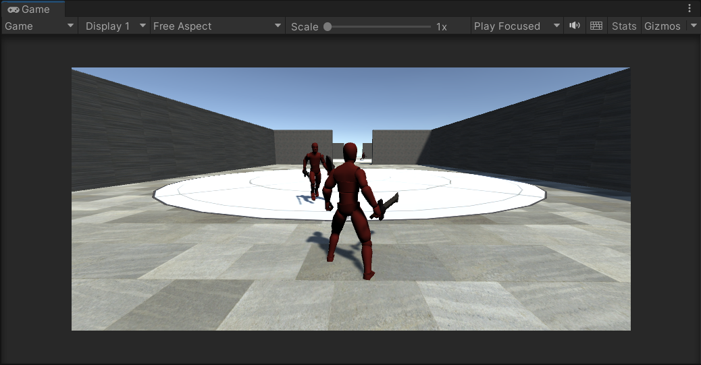
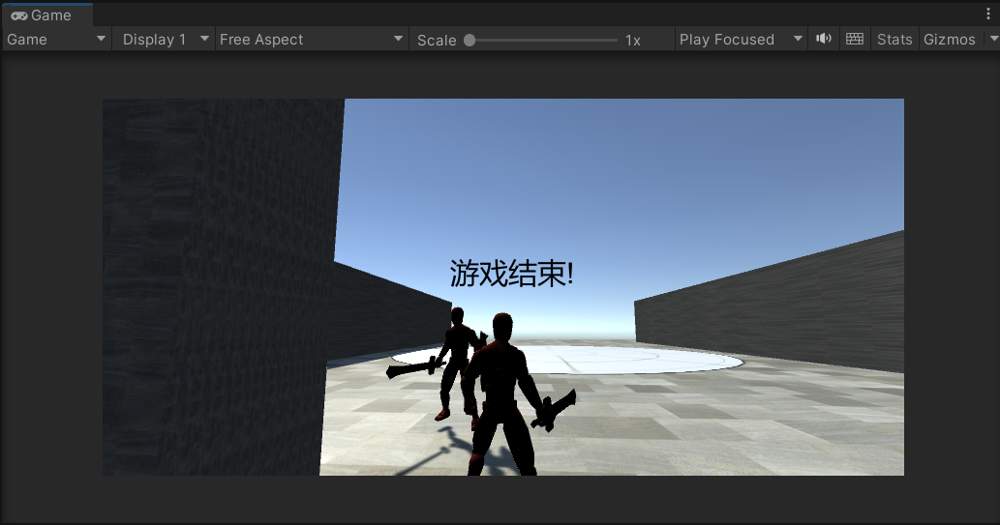
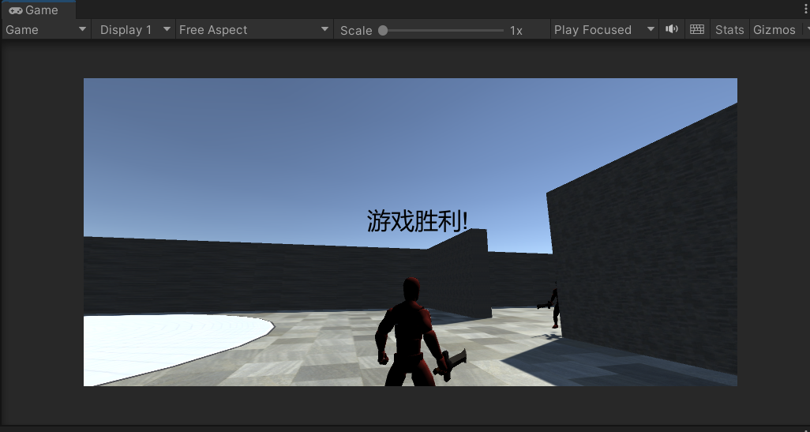

# homework7

### 20337259 叶泽霖

## 作业要求

-  智能巡逻兵 
  -  游戏设计要求： 
    -  创建一个地图和若干巡逻兵(使用动画)； 
    -  每个巡逻兵走一个3~5个边的凸多边型，位置数据是相对地址。即每次确定下一个目标位置，用自己当前位置为原点计算； 
    -  巡逻兵碰撞到障碍物，则会自动选下一个点为目标； 
    -  巡逻兵在设定范围内感知到玩家，会自动追击玩家； 
    -  失去玩家目标后，继续巡逻； 
    -  计分：玩家每次甩掉一个巡逻兵计一分，与巡逻兵碰撞游戏结束；
  -  程序设计要求： 
    -  必须使用订阅与发布模式传消息 
    -  工厂模式生产巡逻兵 
  -  提示1：生成 3~5个边的凸多边型 
    -  随机生成矩形 
    -  在矩形每个边上随机找点，可得到 3 - 4 的凸多边型

## 作业实现

### 人物动画

- 人物动画使用的是在Unity Assert Store中找到的动画素材，包括移动、攻击、受击等动作。
- 

### 玩家控制

- 使用的预制件是素材库中的SwordWarrior预制件

- 

- 编写一个新的动画控制器，主要包括八个方向上的移动；

- 

- 编写控制移动的脚本，主要是依靠获取键盘输入来进行各个方向上的移动；

- ```c#
  using System.Collections;
  using System.Collections.Generic;
  using UnityEngine;
  
  public class WarriorController : MonoBehaviour
  {
      private Animator animator;
      float horizontal;
      float vertical;
      private bool isStay;
      private readonly object stayLock = new();
  
      bool isInvincible;
      float invincibleTimer;
  
      // Start is called before the first frame update
      void Start()
      {
          animator = GetComponent<Animator>();
      }
  
      void Update()
      {
          if (isInvincible)
          {
              invincibleTimer -= Time.deltaTime;
              if (invincibleTimer < 0)
                  isInvincible = false;
          }
      }
  
      void FixedUpdate()
      {
          if (isStay)
              return;
  
          horizontal = Input.GetAxis("Horizontal");
          vertical = Input.GetAxis("Vertical");
          //Debug.Log("horizontal:"+horizontal+", vertical:"+vertical);
          ResetMovingAnime();
          if (horizontal < 0 && vertical > 0)
          {
              ForwardLeftAnime();
          }
          else if (horizontal == 0 && vertical > 0)
          {
              ForwardAnime();
          }
          else if (horizontal > 0 && vertical > 0)
          {
              ForwardRightAnime();
          }
          else if (horizontal > 0 && vertical == 0)
          {
              RightAnime();
          }
          else if (horizontal > 0 && vertical < 0)
          {
              BackwardRightAnime();
          }
          else if (horizontal == 0 && vertical < 0)
          {
              BackwardAnime();
          }
          else if (horizontal < 0 && vertical < 0)
          {
              BackwardLeftAnime();
          }
          else if (horizontal < 0 && vertical == 0)
          {
              LeftAnime();
          }
      }
  
  
      public void ForwardLeftAnime() { animator.SetBool("boolForwardLeftAnime", true); }
      public void ForwardAnime() { animator.SetBool("boolForwardAnime", true); }
      public void ForwardRightAnime() { animator.SetBool("boolForwardRightAnime", true); }
      public void RightAnime() { animator.SetBool("boolRightAnime", true); }
      public void BackwardRightAnime() { animator.SetBool("boolBackwardRightAnime", true); }
      public void BackwardAnime() { animator.SetBool("boolBackwardAnime", true); }
      public void BackwardLeftAnime() { animator.SetBool("boolBackwardLeftAnime", true); }
      public void LeftAnime() { animator.SetBool("boolLeftAnime", true); }
  
      public void ResetMovingAnime()
      {
          animator.SetBool("boolForwardLeftAnime", false);
          animator.SetBool("boolForwardAnime", false);
          animator.SetBool("boolForwardRightAnime", false);
          animator.SetBool("boolRightAnime", false);
          animator.SetBool("boolBackwardRightAnime", false);
          animator.SetBool("boolBackwardAnime", false);
          animator.SetBool("boolBackwardLeftAnime", false);
          animator.SetBool("boolLeftAnime", false);
      }
  
      public bool GetIsStay()
      {
          lock (stayLock)
          {
              return isStay;
          }
      }
      public void SetIsStay(bool isTrue)
      {
          lock (stayLock)
          {
              isStay = isTrue;
          }
      }
  }
  
  ```

- 在预制件中加入一个摄像头，其位置基于父对象的位置，也就是玩家人物的位置

- 

- 为摄像头编写一个脚本，使玩家可以通过鼠标移动控制视角旋转和人物旋转，水平移动的情况下使人物水平旋转，带动摄像头也一起旋转；垂直移动时只会旋转摄像机，人物不会上下旋转；

- ```c#
  using System.Collections;
  using System.Collections.Generic;
  using UnityEngine;
  
  public class MouseView : MonoBehaviour
  {
      public double V = 5;
      private Vector2 mD;
      //The capsule parent!
      private Transform myBody;
  
      // Use this for initialization
      void Start()
      {
          myBody = this.transform.parent;
      }
  
      // Update is called once per frame
      void Update()
      {
          Vector2 mC = new((float)(V*Input.GetAxisRaw("Mouse X")), (float)(V*Input.GetAxisRaw("Mouse Y")));
  
          mD += mC;
          //上下控制相机
          //绕x轴旋转，旋转大小
          this.transform.localRotation = Quaternion.AngleAxis(-mD.y, Vector3.right);
          //左右控制父级
          //绕y轴旋转，旋转大小
          myBody.localRotation = Quaternion.AngleAxis(mD.x, Vector3.up);
      }
  }
  
  ```

### 巡逻兵控制

- 使用的预制件是素材中的ShieldWarrior预制件

- 

- 同样是为其编写一个新的动画控制器，包括站立、移动和攻击三种动画的切换；

- 

- 编写控制巡逻兵的脚本文件，主要涉及巡逻和遇敌两种情况，以下代码仅提取部分，完整脚本文件见Assert文件夹；

- 首先是初始化和Update的部分，Update部分中主要会判断是否巡逻中以及是否遇敌，主要是三种情况，遇敌->前往敌人位置并攻击，未遇敌且不在巡逻状态中->返回巡逻状态，处于巡逻状态中->巡逻。

- 第一种情况下，巡逻兵会前往敌人的位置，在接近到一定范围内后，巡逻兵会转向目标的方向，并执行攻击动画。if (animatorInfo.normalizedTime > 0.99f && animatorInfo.IsName("RightHand@Attack01"))的判断条件是用于判断攻击动画是否已执行完成，执行完成后才会判定为执行了攻击，并向消息订阅者传递这个消息；

- 第二种情况下，一般认为是玩家逃脱了巡逻兵的追逐，因此巡逻兵会返回自己的领地并继续巡逻；

- 第三种情况下，巡逻兵默认会执行巡逻；

  ```C#
  void Start()
  {
      fieldOfView = 150.0f;    
  	animator = GetComponent<Animator>();
      nextPos = new Vector3();
  
      SetIsPatrolling(true);
      SetIsArrived(true);
      SetIsInView(false);
      SetIsCanSee(false);
      SetIsStay(false);
  }
  
  // Update is called once per frame
  void FixedUpdate()
  {
      AnimatorStateInfo animatorInfo = animator.GetCurrentAnimatorStateInfo(0);//必须放在update里
      ResetAnime();
      if (isStay)
          return;
      if(Engage())
      {
          SetIsPatrolling(false);
          SetIsArrived(false);
          GoToPosition(target.transform.localPosition);
          if (IsCloseToTarget())
          {
              TurnToPosition(target.transform.localPosition);
              AttackAnime();
              if (animatorInfo.normalizedTime > 0.99f && animatorInfo.IsName("RightHand@Attack01"))
              {
                  SetIsPatrolling(true);
                  SetIsArrived(true);
                  Debug.Log("enenmy hitted!");
                  HasAttack?.Invoke(true);
              }
          }   
      }
      if(!Engage() && !GetIsPatrolling())
      {
          SetIsPatrolling(true);
          Debug.Log("Escape!");
          IsEscape?.Invoke(true);
      }
      if (GetIsPatrolling())
      {
          Patrol();
      }
  }
  ```

- 首先是巡逻的部分，主要的函数包括巡逻的主函数、判断是否在领地内、获取下一个目标点的位置、前往目标位置、转向目标位置的函数。

- 首先是巡逻的函数，主要包括两个条件的判断一个为是否抵达目标点，另一个为是否处于领地当中。在巡逻兵的设计中，每个巡逻兵的都会有一个中心点的属性以及领地半径大小的属性，其领地就是以中心点为圆心，领地半径为圆半径的一个圆。当巡逻兵的是否抵达目标点为true的情况下，会根据是否在领地上来判断如何获取下一个点的位置，这里强调在领地上而不是领地内是可以看下面IsInArea()的解释。如果在领地上，则调用GetNextPoint()来获取下一个点的位置，否则前往领地上固定的两个点中的随机一个，重新开始巡逻，两个固定点可以理解为单位圆上的(-1, 0)和(1, 0)两个点。在获取到目标点后，isArrived会被设为false，然后会执行goToPosition()，前往目标点。

- bool IsInArea()：判断巡逻兵与领地中心的距离是否在领地半径附近，允许一定的误差。

- Vector3 GetNextPos()：返回下一个目标点。原理主要是随机获取一个1-180范围内的度数，然后基于当前位置和领地中心坐标的角度，顺时针加上这个度数，然后用极坐标的方式算出下一个点的坐标并返回。

- void GoToPosition(Vector3 targetPos)：主要是使用素材中的动画来实现移动，由于移动会有一个固定距离的问题，因此判断是否抵达目标点需要保留一定的误差，在距离较小时，就会使用平移的方式来移动，而不是采用动画来移动，在距离更小但没完全抵达时，就会判定为抵达。

- void TurnToPosition(Vector3 targetPos)：旋转巡逻兵的方向，使其朝向目标位置。

- ```C#
  void Patrol()
      {
          if(IsInArea() && GetIsArrived())
          {
              lock(nextPosLock)
              {
                  nextPos = GetNextPos();
              }
              SetIsArrived(false);
          }
          else if(!IsInArea() && GetIsArrived())
          {
              lock (nextPosLock)
              {
                  System.Random rd = new();
                  float homePoint = rd.Next(-1, 2);
                  //Debug.Log("homePoint: " + homePoint);
                  nextPos.x = centerPos.x + homePoint * radiusOfPatrol;
                  nextPos.y = this.transform.localPosition.y;
                  nextPos.z = centerPos.z;
              }
              SetIsArrived(false);
          }
          lock (nextPosLock)
          {
              GoToPosition(nextPos);
          }  
      }
      bool IsInArea()
      {
          Vector3 curPos = this.transform.localPosition;
          double distance = Math.Pow(Math.Abs(curPos.x - centerPos.z), 2.0) + Math.Pow(Math.Abs(curPos.z - centerPos.z), 2.0);
          return Math.Abs(distance - Math.Pow(radiusOfPatrol, 2.0)) < 0.8;
      }
      Vector3 GetNextPos()
      {
          nextPos = new Vector3();
          System.Random rd = new();
          float nextAngle = rd.Next(1, 180);
          Vector3 curPos = this.transform.localPosition;
          float cosA = (curPos.x - centerPos.x) / radiusOfPatrol;
          if (Math.Abs(cosA) > 1)
              cosA = 1;
          float angleA = MathF.Acos(cosA) * (180/MathF.PI);
          float angleC = angleA + nextAngle;
          //Debug.Log(cosA +" "+ angleA +" "+ angleC);
  
          nextPos.x = radiusOfPatrol * MathF.Cos(angleC) + centerPos.x;
          nextPos.y = curPos.y;
          nextPos.z = radiusOfPatrol * MathF.Sin(angleC) + centerPos.z;
          Debug.Log("getNextPos: " + nextPos.x + " " + nextPos.z);
          return nextPos;
      }
      void GoToPosition(Vector3 targetPos)
      {
          /*var direction = targetPos - this.transform.localPosition;//目标方向
          transform.Translate(direction.normalized * Time.deltaTime * 0.5f, Space.World);//向目标方向移动，normalized归一实现匀速移动*/
          float disX = MathF.Abs(targetPos.x - this.transform.localPosition.x);
          float disZ = MathF.Abs(targetPos.z - this.transform.localPosition.z);
          if (disX < 0.2 && disZ < 0.2)
          {
              //Debug.Log("isArrived!, " + this.transform.localPosition.x + " " + this.transform.localPosition.z + " " + disX + " " + disZ);
              SetIsArrived(true);
          }
          else if(disX < 1.0 && disZ < 1.0)
          {
              var direction = targetPos - this.transform.localPosition;//目标方向
              transform.Translate(1.0f * Time.deltaTime * direction.normalized, Space.World);//向目标方向移动，normalized归一实现匀速移动
              //Debug.Log("close to arrive: " + targetPos.x + " " + targetPos.z);
          }
          else
          {
              TurnToPosition(targetPos);
              MoveAnime();
              //Debug.Log("is moving to: " + targetPos.x + " " + targetPos.z);
          }
      }
      void TurnToPosition(Vector3 targetPos)
      {
          var direction = targetPos - this.transform.localPosition;//目标方向
          var angle = Vector3.Angle(transform.forward, direction);//获取夹角
          var cross = Vector3.Cross(transform.forward, direction);
  
          var turn = cross.y >= 0 ? 1f : -1f;
          transform.Rotate(transform.up, angle * Time.deltaTime * 5f * turn, Space.World);
      }
  ```

- 然后是遇敌的部分，主要是一个射线检测和触发器的相关函数的部分。射线检测主要是为了检测是否有物体遮挡。

- 触发器相关的函数是基于巡逻兵的一个Sphere Collider组件，在设定好大小后，玩家进入该碰撞体就会触发响应函数，认为玩家进入了巡逻兵的视野范围，isInView被设为true，然后会进行射线检测，其结果会被返回为isCanSee的值，若isInView和IsCanSee同时为true，则被认为遇敌，巡逻兵就会执行遇敌情况下的代码。

- ```C#
  bool Engage()
      {
          return GetIsInView() && GetIsCanSee();
      }
      bool RayCheck()
      {
          Vector3 forward = transform.forward;//人物前方正方向
          Vector3 playerDir = target.transform.position - transform.position;//人物到被检测物体的方向
          float temp = Vector3.Angle(forward, playerDir);//求出角度
          //向被检测物体发射射线，为了判断之间是否有障碍物遮挡
          bool res = Physics.Raycast(transform.position + Vector3.up, target.transform.position - transform.position, out RaycastHit hitInfo);
          //Debug.Log("rayCheck: " + temp + " " + res + " " + hitInfo.transform.name);
          if (temp < 0.5f * fieldOfView && (res == false || hitInfo.collider.CompareTag("Player")))
          {
              return true;//被检测物体在视野中
          }
          return false;//被检测物体不在视野中
      }
      void OnTriggerEnter(Collider other)
      {
          if (other.gameObject.CompareTag("Player"))
          {
              target = other.gameObject;
              //提前计算角度差
              SetIsInView(true);
              SetIsCanSee(RayCheck());
              //Debug.Log("Enter: " + GetIsInView() + " " + GetIsCanSee());
          }
      }
      void OnTriggerStay(Collider other)
      {
          if (other.gameObject.CompareTag("Player"))
          {
              if (target == null)
              {
                  target = other.gameObject;
              }
              //SetIsInView(true);
              //SetIsCanSee(RayCheck());
              Debug.Log("Stay: " + GetIsInView() + " " + GetIsCanSee());
          }
      }
      void OnTriggerExit(Collider other)
      {
          if (other.gameObject.CompareTag("Player"))
          {
              target = null;
              SetIsInView(false);
              SetIsCanSee(false);
          }
      }
      bool IsCloseToTarget()
      {
          Vector3 curPos = this.transform.localPosition;
          double distance = Math.Pow((curPos.x - target.transform.localPosition.x), 2.0) + Math.Pow((curPos.z - target.transform.localPosition.z), 2.0);
          return Math.Abs(distance) < 9;
      }
  ```

### 工厂模式和巡逻兵工厂

- 工厂模式以单例模式生成，主要包括创建巡逻兵和停止巡逻的函数。

- ```C#
  using System.Collections;
  using System.Collections.Generic;
  using UnityEngine;
  
  public class PatrolFactory : MonoBehaviour
  {
      private List<GameObject> usedPatrols = new();
      private Vector3[] vec = new Vector3[3];     // 保存每个巡逻兵的初始位置
  
      private static volatile PatrolFactory instance = null;//保证instance在所有线程中同步
                                                            //private防止类在外部被实例化
      private PatrolFactory(){ }
      public static PatrolFactory Instance()
      {
          return instance;
      }
      void Awake()
      {
          instance = this;
      }
  
      public List<GameObject> CreatePatrols()
      {
          int[] pos_x = { 0, 0, 0 };
          int[] pos_z = { 40, 0, -40 };
          int[] radiusOfPatrol = { 10, 10, 10 };
          int index = 0;
          for (int i = 0; i < 3; i++)
          {
              vec[index] = new Vector3(pos_x[i], 0, pos_z[i]);
              index++;
          }
          
          for (int i = 0; i < 3; i++)
          {
              GameObject patrol = Instantiate(Resources.Load<GameObject>("Prefab/ShieldWarrior"));
              patrol.transform.position = vec[i];
              patrol.GetComponent<PatrolController>().centerPos = vec[i];
              patrol.GetComponent<PatrolController>().radiusOfPatrol = radiusOfPatrol[i];
  
              usedPatrols.Add(patrol);
              
          }
          return usedPatrols;
      }
  
      public void StopPatrol()
      {
          for (int i = 0; i < usedPatrols.Count; i++)
          {
              usedPatrols[i].GetComponent<PatrolController>().SetIsStay(true);
          }
      }
  
      public List<GameObject> GetPatrols()
      {
          return usedPatrols;
      }
  }
  ```

### 积分系统

- 同样是单例模式生成，其订阅来自每个巡逻兵的消息，一旦有巡逻兵发布Escape的事件，就会加一分，若分数达到3分，就会向主控系统发布游戏胜利的消息。

- ```c#
  using System.Collections;
  using System.Collections.Generic;
  using UnityEngine;
  
  public class ScoreController : MonoBehaviour
  {
      private static volatile ScoreController instance = null;
      public delegate void GameWinHandler(int value);
      public event GameWinHandler GameWin;
      public int score;
      public const int winningPoint = 1;
  
      private readonly object scoreLock = new();
  
      private ScoreController() { }
      public static ScoreController Instance()
      {
          return instance;
      }
      void Awake()
      {
          instance = this;
      }
  
      // Start is called before the first frame update
      void Start()
      {
          SetScore(0);
      }
  
      public void ObserveIsEscape(bool value)
      {
          int curScore = GetScore() + 1;
          SetScore(curScore);
          Debug.Log("the score is now:" + GetScore());
      }
  
      public int GetScore()
      {
          lock (scoreLock)
          {
              return score;
          }
      }
      private void SetScore(int value)
      {
          lock (scoreLock)
          {
              score = value;
              if (score >= winningPoint)
                  GameWin?.Invoke(score);
          }
      }
  }
  
  ```

### 主控系统

- 主要负责玩家和巡逻兵工厂以及积分系统的实例化以及控制，还有游戏胜利和游戏结束事件的处理。

- 在创建了巡逻兵以后，为积分系统订阅每一个巡逻兵的Escape事件，为自己订阅积分系统的游戏胜利事件。

- ```c#
  using System.Collections;
  using System.Collections.Generic;
  using UnityEngine;
  using UnityEngine.UI;
  
  public class MainController : MonoBehaviour
  {
      private PatrolFactory patrolFactory;
      private ScoreController scoreController;
      private GameObject player;
  
      private bool isGameOver;
      private bool isGameWin;
  
      // Start is called before the first frame update
      void Start()
      {
          isGameOver = false;
  
          player = Instantiate(Resources.Load<GameObject>("Prefab/SwordWarrior"));
          player.transform.position = new Vector3(0, 0, -65);
          patrolFactory = PatrolFactory.Instance();
          patrolFactory.CreatePatrols();
          scoreController = ScoreController.Instance();
          scoreController.GameWin += ObserveGameWin;
          foreach(GameObject patrol in patrolFactory.GetPatrols())
          {
              patrol.GetComponent<PatrolController>().IsEscape += scoreController.ObserveIsEscape;
              patrol.GetComponent<PatrolController>().HasAttack += ObserveGameOver;
          } 
      }
  
      public int GetScore()
      {
          return scoreController.GetScore();
      }
  
      public void ObserveGameOver(bool value)
      {
          patrolFactory.StopPatrol();
          //player.GetComponent<PatrolController>().SetIsStay(true);
          Debug.Log("GameOver!");
          isGameOver = true;
      }
  
      public void ObserveGameWin(int value)
      {
          patrolFactory.StopPatrol();
          Debug.Log("you win! your score is now:" + value);
          isGameWin = true;
      }
  
      public void OnGUI()
      {
          if(isGameOver)
          {
              GUIStyle textStyle = new();
              textStyle.fontSize = 30;
              GUI.Label(new Rect(Screen.width / 2 - 55, Screen.width / 2 - 250, 100, 100), "游戏结束!", textStyle);
          }
          else if (isGameWin)
          {
              GUIStyle textStyle = new();
              textStyle.fontSize = 30;
              GUI.Label(new Rect(Screen.width / 2 - 55, Screen.width / 2 - 250, 100, 100), "游戏胜利!", textStyle);
          }
      }
  }
  
  ```

## 实现效果

### 游戏过程



### 游戏结束



### 游戏胜利

