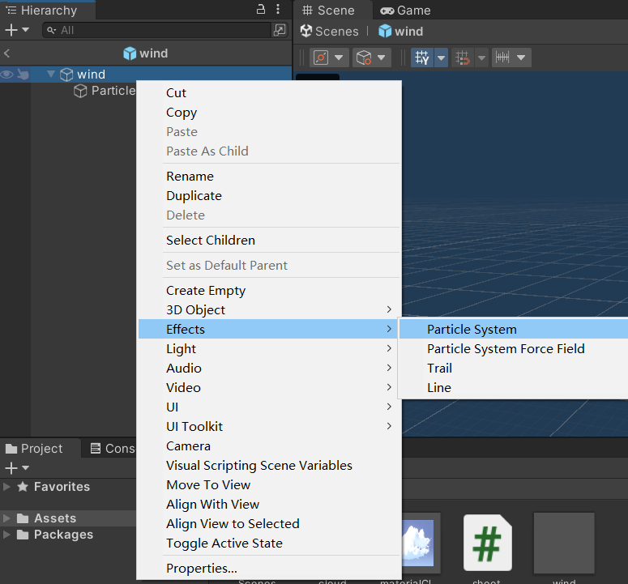
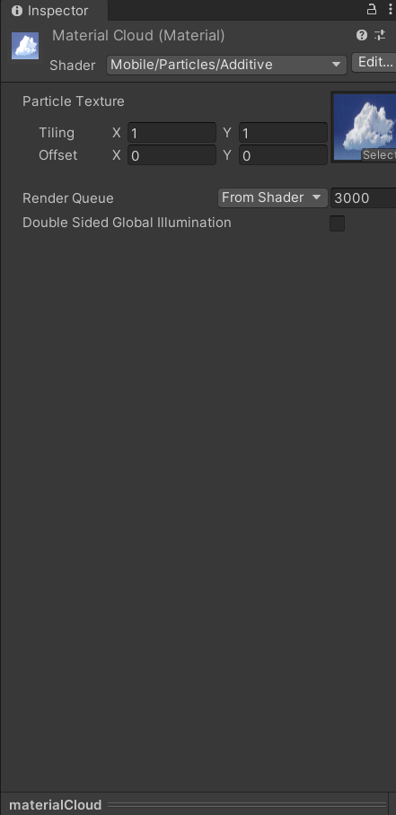
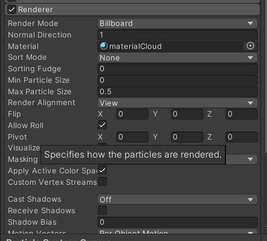
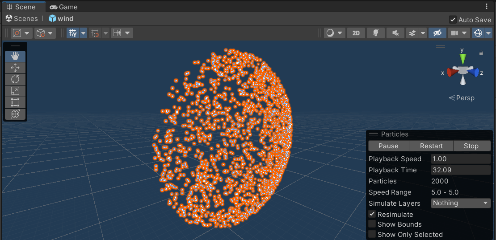
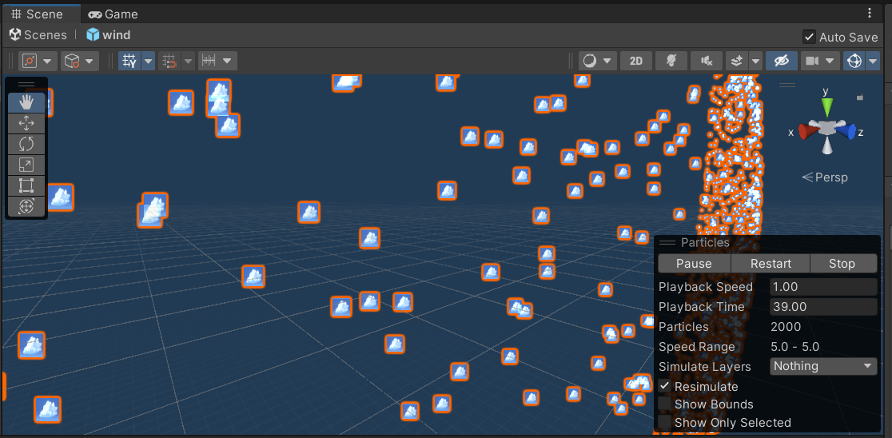
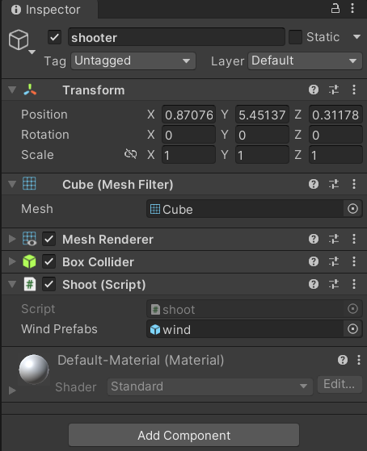
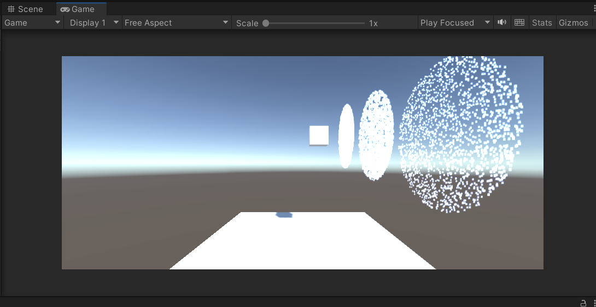

# homework8

### 20337259 叶泽霖

## 作业要求

-  简单粒子制作 
  -  按参考资源要求，制作一个粒子系统 
  -  用代码控制使之在不同场景下效果不一样

## 作业实现

### 创建粒子系统

- 新建一个empty object并为其附加粒子系统
- 
- 在检视窗口修改其属性
- 
- 新建一个材质球并将准备好的贴图附着在上面
- 
- 将材质球设置为粒子的材质
- 
- 此时会出现粒子都是方形的情况
- 
- 可以通过修改粒子属性及大小等方式来实现小型化
- 
- 凑近了看可以发现仍然是方形的，只是因为粒子大小太小导致不太明显
- 

### 使用代码进行控制

- 编写脚本文件，使得在按下按键w后，会创建一个指定好的预制件

- ```c#
  using System.Collections;
  using System.Collections.Generic;
  using UnityEngine;
  
  public class shoot : MonoBehaviour
  {
      public GameObject windPrefabs;
      // Update is called once per frame
      void Update()
      {
          if (Input.GetKeyDown(KeyCode.W))
          {
              Instantiate(windPrefabs, transform.position, transform.rotation);
          }
      }
  }
  ```

- 新建一个cube，将脚本附加在cube上，并将制作好的粒子prefab设定为所需的GameObject

- 

- 按下w即可发射粒子，这里提前将粒子发射模式改为burst，因此会一次性发射大量粒子

- 

