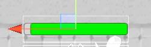
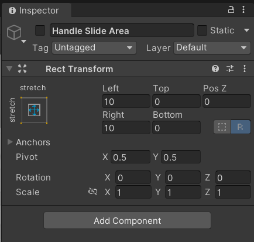
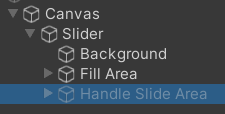
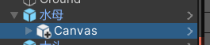
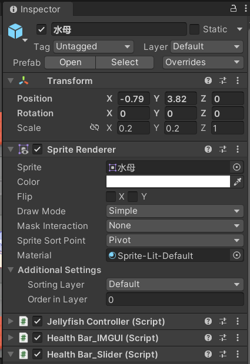
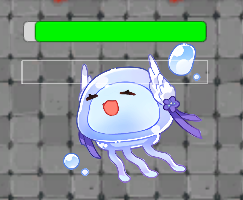
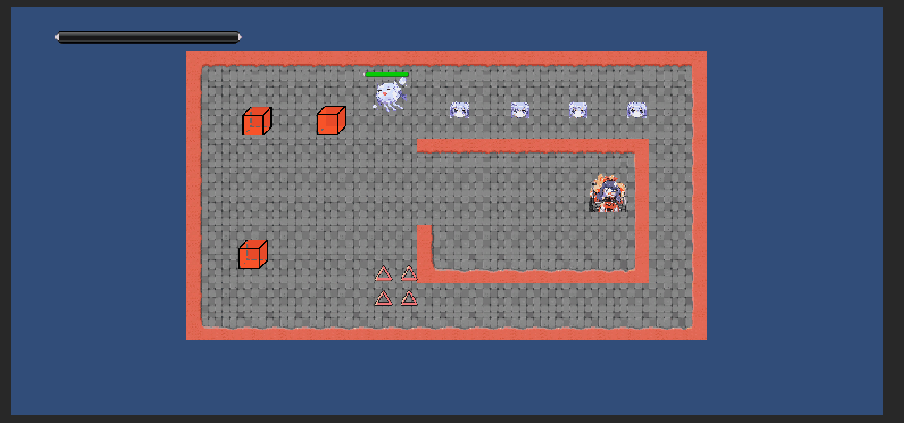

# homework9

### 20337259 叶泽霖

## 作业要求

-  血条（Health Bar）的预制设计。具体要求如下 
  -  使用 IMGUI 和 UGUI 实现 
  -  使用 UGUI，血条是游戏对象的一个子元素，任何时候需要面对主摄像机 
  -  分析两种实现的优缺点 
  -  给出预制的使用方法

## 作业实现

### IMGUI实现

- 以代码方式实现并将脚本附加在对象上即可。主要方法是新建一个滑动条，然后为其设定好位置以及对应的血量的数值即可。

- ```c#
  using System.Collections;
  using System.Collections.Generic;
  using UnityEngine;
  using UnityEngine.UI;
  
  public class healthBar_IMGUI : MonoBehaviour
  {
      private Rect healthPos; //血条的位置
      public Slider slider;
  
      private void OnGUI()
      {
          int currentHealth = this.gameObject.GetComponent<JellyfishController>().currentHealth;
          int maxHealth = this.gameObject.GetComponent<JellyfishController>().maxHealth;
          healthPos = new Rect(50, 25, 200, 20);
          //Debug.Log("HealthBar:" + currentHealth);
          GUI.HorizontalScrollbar(healthPos, 0, currentHealth, 0.0f, maxHealth);
      }
  }
  ```

- 效果图

- 

### UGUI实现

- 新建一个Canvas画布，在其中再选择新建一个Slider

- 

- 取消勾选Handle Slide Area

- 

- 剩下的两部分一个是背景一个是填充区域，其中的数值我们可以依靠代码来控制。

- 

- 用代码控制填充区域来实现血条的变动以及根据血量百分比的颜色变化。

- ```C#
  using System.Collections;
  using System.Collections.Generic;
  using UnityEngine;
  using UnityEngine.UI;
  
  public class healthBar_Slider : MonoBehaviour
  {
      public Slider slider;
  
      // Start is called before the first frame update
      void Start()
      {
          slider.fillRect.transform.GetComponent<Image>().color = Color.green;
      }
  
      // Update is called once per frame
      void Update()
      {
          int currentHealth = this.gameObject.GetComponent<JellyfishController>().currentHealth;
          int maxHealth = this.gameObject.GetComponent<JellyfishController>().maxHealth;
          //Debug.Log("HealthBar_Slider:" + currentHealth);
          slider.maxValue = maxHealth;
          slider.value = currentHealth;
          float healthPercentage = (float)currentHealth / (float)maxHealth;
  
          if (0.2 < healthPercentage && healthPercentage <= 0.5) 
          {
              slider.fillRect.transform.GetComponent<Image>().color = Color.yellow; 
          }
          else if (healthPercentage <= 0.2) 
          { 
              slider.fillRect.transform.GetComponent<Image>().color = Color.red; 
          }
          else
          {
              slider.fillRect.transform.GetComponent<Image>().color = Color.green;
          }
      }
  }
  ```

- 将脚本和做好的预制Canvas都挂在目标对象上。

- 

- 

- 即可实现血条效果。

- 

- 实际效果图

- 可以看到，在游戏角色前往到三角地刺上时，自身头顶的UGUI构建的血条和左上用IMGUI构建的血条都在跳动。UGUI构建的血条在血量掉到一定程度时会改变颜色，而在拾取了右上角的血包以后，血条形态也在慢慢恢复。

- 

### 两种实现的优缺点

- IMGUI
  - 优点
    - 可以通过代码控制所有组件，开发比较简单；
  - 缺点
    - 出于性能原因，Unity不推荐将IMGUI用于游戏内运行时UI；
    - 效率比较低下，难以调试；
- UGUI
  - 优点
    - 有锚点，更适合屏幕自适应；
    - 支持多模式、多摄像机渲染；
  - 缺点
    - 需要比较多Canvas
    - 无法为Unity编辑器开发用户界面

### 预制的使用方法

- IMGUI
  - 将脚本挂载到对象上即可。
- UGUI
  - 需要将预制件和控制脚本都挂载到对象上。


